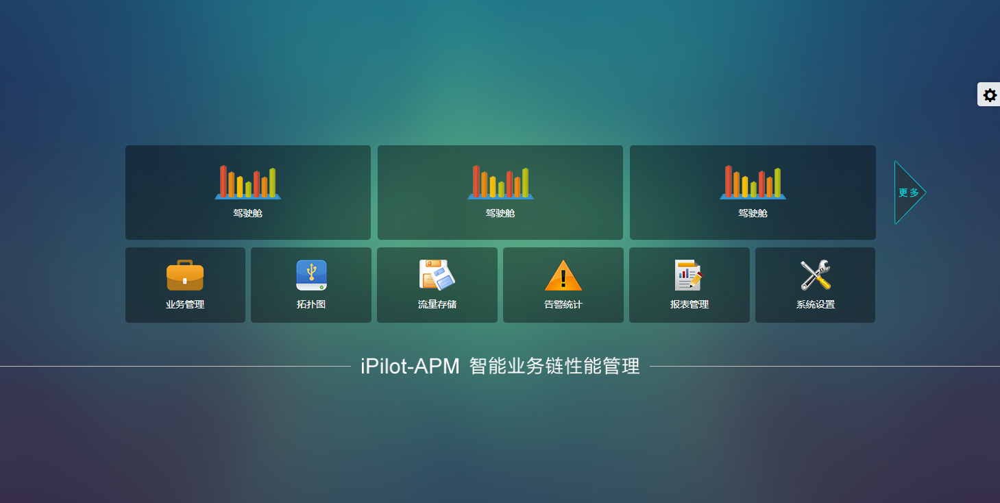

# flexIndex
基于Flexbox布局的现代化响应式首页Demo

本项目是一个充分利用CSS3 Flexbox布局特性的现代化响应式首页，展示了flex布局在各种场景下的优雅应用。

## 🎯 项目特点

### 1. 全面的Flexbox布局应用
- **整体布局**：使用`display: flex`和`flex-wrap: wrap`创建响应式整体布局
- **居中对齐**：大量使用`justify-content: center`和`align-items: center`实现完美居中
- **空间分布**：使用`justify-content: space-between`智能分配导航项间距
- **弹性容器**：所有主要组件都采用flex布局，确保内容自适应

### 2. 响应式设计
- **自适应布局**：结合flex布局和媒体查询，完美适配桌面、平板、手机
- **弹性图片**：使用`img-responsive`类确保图片在各种屏幕下正常显示
- **流动布局**：flex-wrap确保在小屏幕上自动换行，保持良好可读性

### 3. 模块化结构
- **清晰的HTML结构**：语义化标签，易于理解和维护
- **分离的CSS文件**：按功能分离样式文件，提高代码可维护性
- **优化的资源加载**：关键CSS内联，非关键资源异步加载

### 4. 交互体验
- **平滑过渡**：hover效果和状态切换使用CSS过渡
- **直观的导航**：清晰的视觉层次和交互反馈
- **皮肤切换**：支持多种主题皮肤，提供个性化体验

## 🎨 Flex布局亮点

- **`.indeBox`**：使用flex创建整体页面框架
- **`.topContent8`**：水平和垂直居中的内容区域
- **`.itmBox1` & `.itmBox2`**：使用space-between实现均匀分布的导航网格
- **`.logo-index`**：完美的logo居中对齐
- **`.footer`**：底部内容弹性布局

## 📱 响应式特性

- 桌面端：完整的多列布局
- 平板端：自适应的网格系统
- 移动端：单列堆叠布局，保持可用性

## 🚀 技术栈

- **CSS3**：Flexbox布局、媒体查询
- **Bootstrap**：响应式框架支持
- **jQuery**：交互功能
- **HTML5**：语义化标签

## 📸 预览效果

首页效果：


其它特性展示：


## 🚀 快速启动

### 方法一：使用Node.js http-server（推荐）

1. **安装http-server**（如果尚未安装）：
```bash
npm install -g http-server
```

2. **启动项目**：
```bash
# 在项目根目录下执行
http-server -p 8080
```

3. **访问项目**：
打开浏览器访问：http://localhost:8080

### 方法二：使用Python内置服务器

1. **Python 3**：
```bash
# 在项目根目录下执行
python -m http.server 8080
```

2. **Python 2**：
```bash
# 在项目根目录下执行
python -m SimpleHTTPServer 8080
```

### 方法三：使用PHP内置服务器

```bash
# 在项目根目录下执行
php -S localhost:8080
```

### 方法四：直接打开（不推荐）

可以直接双击`index.html`文件在浏览器中打开，但某些功能（如字体加载）可能无法正常工作。

## 📁 项目结构

```
flexIndex/
├── index.html          # 首页文件
├── css/                # 样式文件
│   ├── common.css      # 主要样式（包含flex布局）
│   ├── responsive.css  # 响应式样式
│   └── critical.css    # 关键CSS
├── js/                 # JavaScript文件
├── images/             # 图片资源
├── fonts/              # 字体文件
└── README.md           # 项目说明
```

## ⚡ 开发建议

- 使用**Chrome DevTools**的移动端调试模式测试响应式效果
- 推荐使用**Live Server**插件进行实时预览
- 修改CSS后建议清除浏览器缓存查看效果
